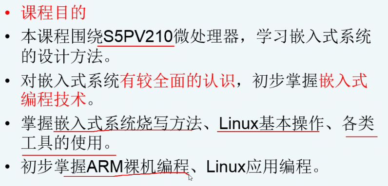

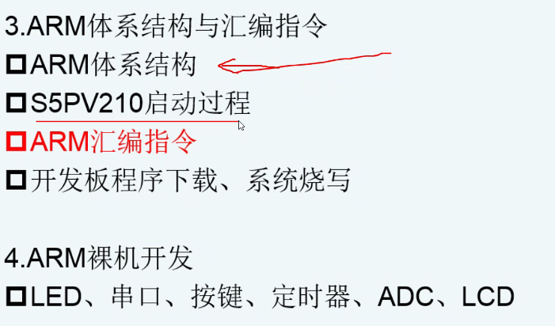


实时性要求

可靠性要求

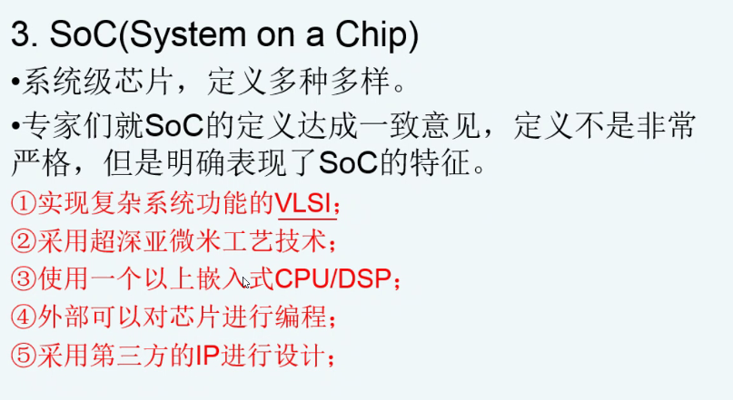

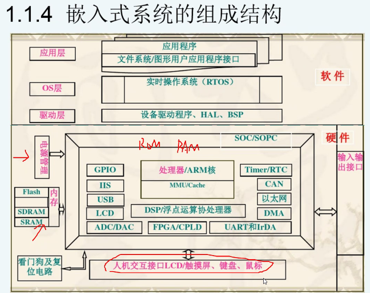


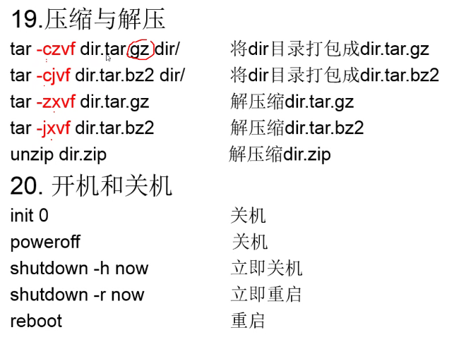

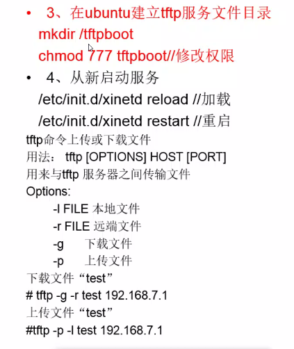

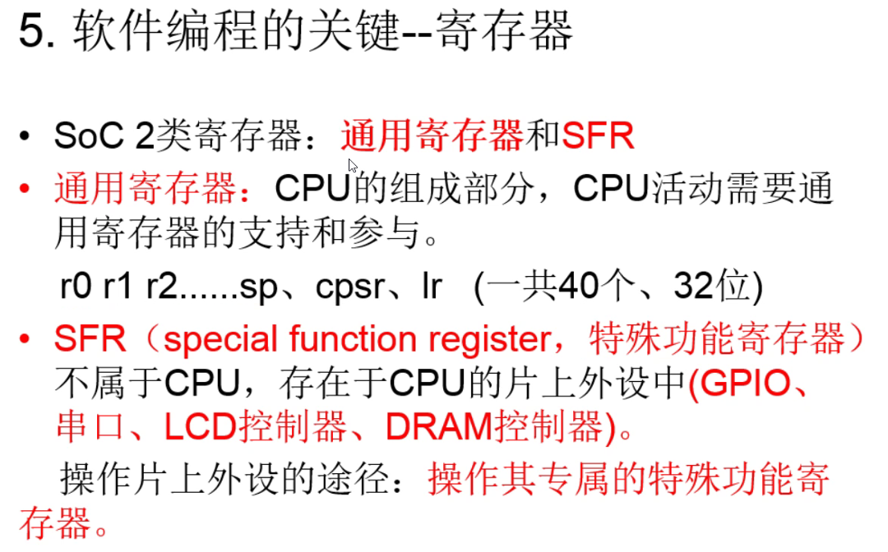

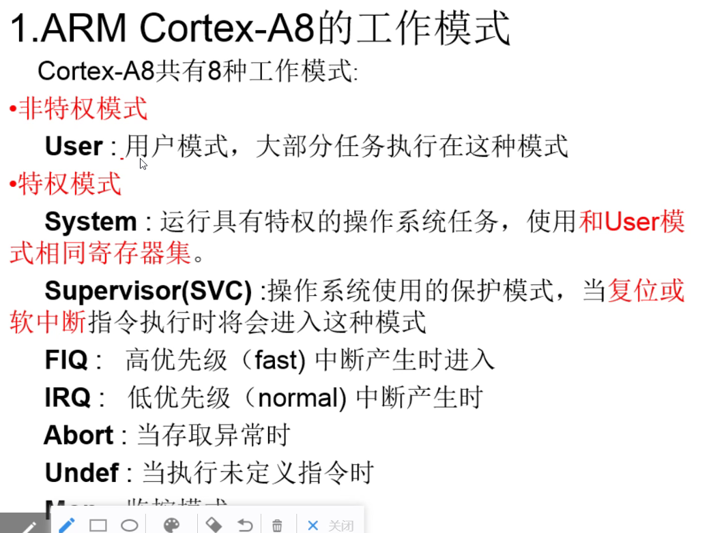

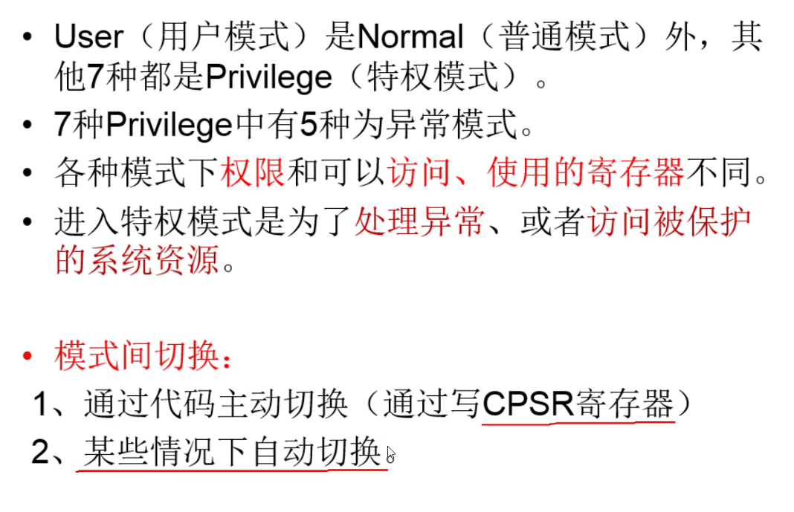

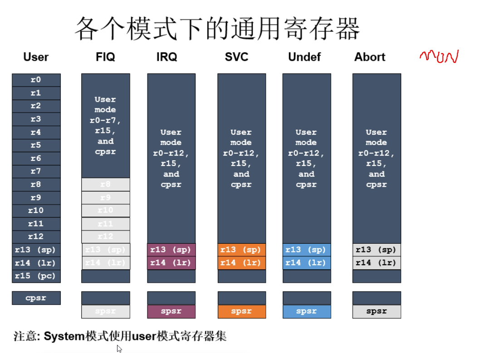


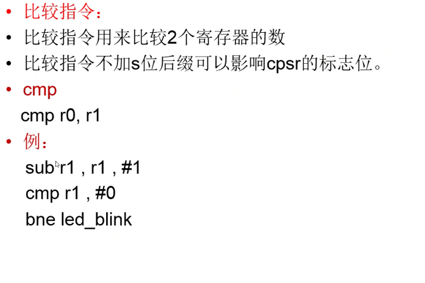


## kk

```assembly
ldr	(内存->通用寄存器)

//ldr伪指令

ldr r0,=0xff

flag：	（死循环）
```

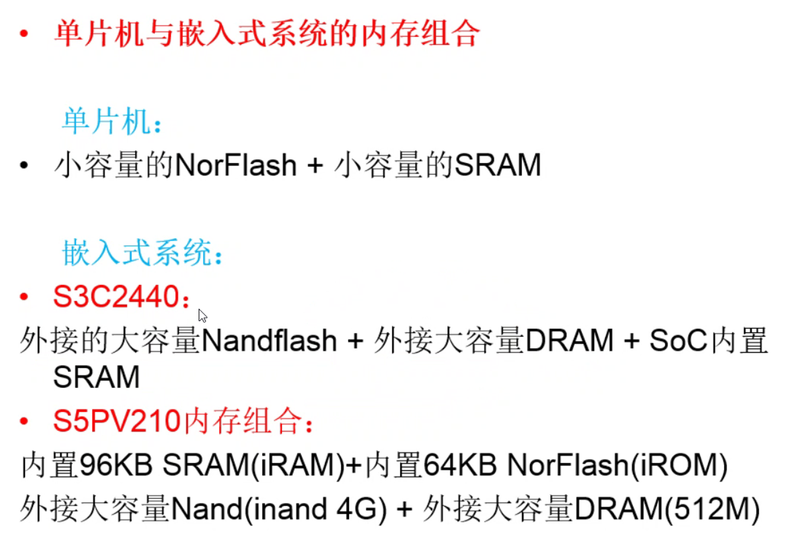

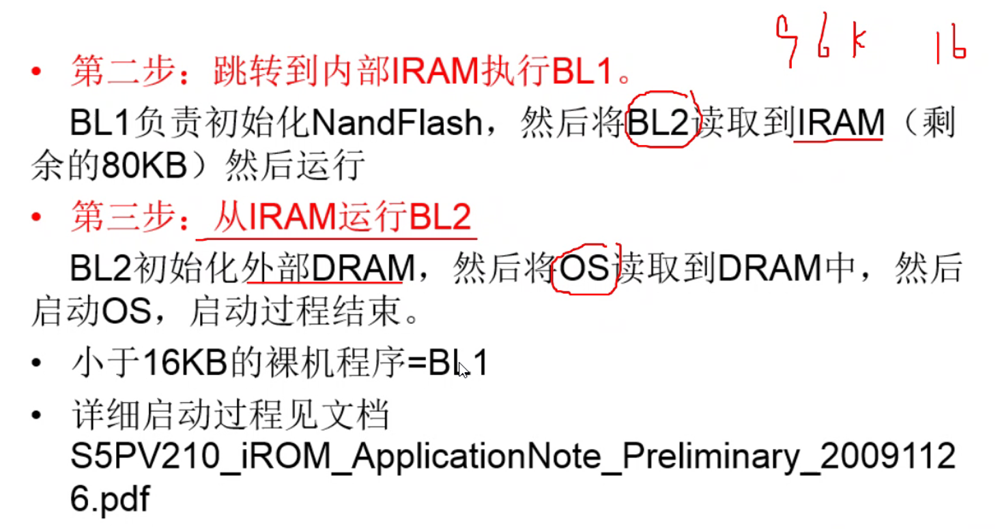

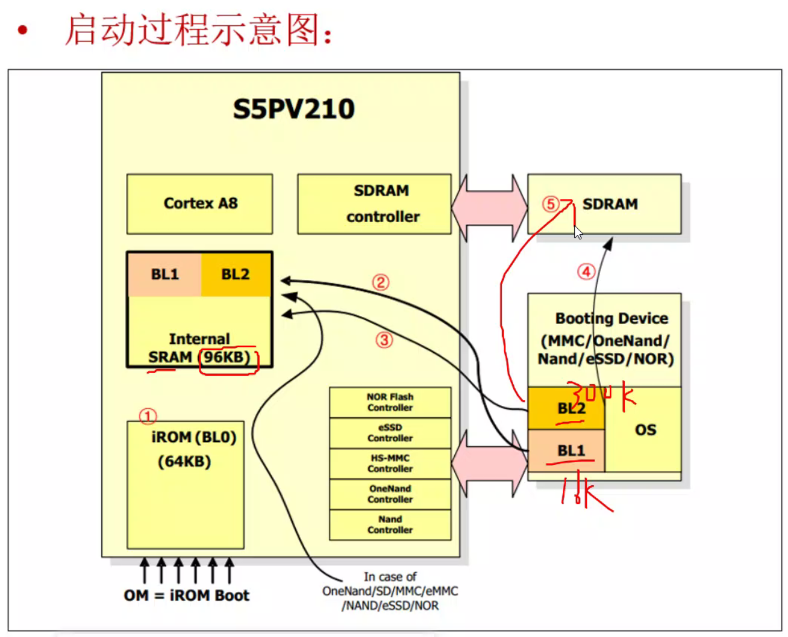


> .global _start // 这一句代码指令是将_start链接属性改为歪脖， 这样其他文件就可以看见_start了。
>
> _start 标号
>
> halt:
> b halt 这个就相当于死循环。
>
> ldr r1, = 0x30020001 // 将值0x30020001 写入r1寄存器中。
> ldr r0 , =0x011111111 // 将值0x01111111写入r0寄存器中。
> str r0， [r1] // 将r0的值写入到以r1位内存地址的内存中去
>
> b 跳转指令 b halt 跳转到 标号为halt 地方里面。这里相当于一个死循环。
>
> 另一种死循环的方法是：
>
> b . // .代表当前这一句指令的地址。

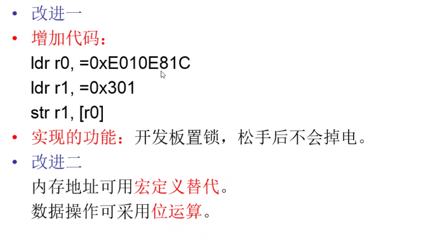

## 汇编可使用宏定义\位运算

```assembly
#define GPJ0CON 0xe0200240

ldr r0,=(1<<3)|(1<<4)|(1<<5)
bl delay		//延时 pc-->lr pc=delay


//延时子函数
delay:
	ldr r2,=9000000
	ldr r3,=0
delay_loop:	
	sub r2,r2,#1	//减1
	cmp	r2,r3		//r2-r3 影响CPSR C N Z V
	bne delay_loop	//ne不相等 跳转
	mov pc,lr		//pc=lr
	//返回 返回地址保存lr  pc==lr
	
	
//在不改变其他位的情况下，实现如下功能 
//(1)将寄存器0xe0200240的bit 5清0。 
//(2)将寄存器0xe0200240的bit 6置1。 
//(3)将寄存器0xe0200240的bit 7取反。
	ldr r0,=0xe0200240
	mov r1,[r0]
	and r1,(~(1<<5))
	str r1,[r0]
	
	ldr r2,=0xe0200240
	mov r1,[r2]
	or  r1,(1<<6)
	str r1,[r2]
	
	ldr r3,=0xe0200240
	mov r1,[r3]
	xor r1,(1<<7)
	str r1,[r3]
	
//(1)将寄存器0xe0200240的bit0-bit3改为0001。 
//(2)将寄存器0xe0200240的bit4-bit7改为0001。 
	ldr r0,=0xe0200240
	mov r1,[r0]
	and r1,0xfffffff0
	or  r1,0x01
	str r1,[r0]
	
	ldr r0,=0xe0200240
	mov r1,[r0]
	and r1,0xffffff0f
	or  r1,0x10
	str r1,[r0]
	
	//将0x11111111写入寄存器0xe0000000中。 1、汇编方式： 2、C语言方式：
	ldr r0,=0xe0000000
	ldr r1,=0x11111111
	str r1,[r0]
	
	c:
	int *p=0xe0000000;
	*p=0x11111111;
	
	
	//将寄存器0xe00000000的bit4-bit7修改0001，其余位不变 1、汇编方式： 2、C语言方式： 
	ldr r0,=0xe0000000
	ldr r1,[r0]
	bic r1,r1,#0xf0
	orr r1,r1,#0x10
	str r1,[r0]
	
	c:
	int *p=0xe0000000;
	*p=(*p&0xf0)|0x10;
	
	
```


> 一：逻辑运算指令
>
> 1      逻辑与运算AND DEST,SRC     ；将操作数相与，返回给DEST。CF,OF 是0，影响ZF,SF,PF。
>
> 2      逻辑或运算 OR   DEST,SRD    ; 将操作数相或，返回给DEST。CF,OF 是0，影响ZF,SF,PF。
>
> 3      逻辑非运算 NOT   操作数     ；将操作数各位取反。
>
> 4      逻辑异或运算  XOR   DEST,SRC   ; 将操作数相异或，返回给DEST。CF,OF 是0，影响ZF,SF,PF。
>
> 5   测试指令 TEST   DEST,SRC    ;将操作数相与，影响状态标志，主要用于给数据转移指令传递状态标志。
>
> 二：移位指令
>
> 移出的数传给CF。
>
> 1      移位指令
>
> SHL   DEST,SRC     ;逻辑左移指令，低位用0补齐
>
> SHR   DEST,SRC    ; 逻辑右移指令，高位用0补齐
>
> SAL   DEST,SRC     ;算术左移指令，低位用0补齐
>
> SAR   DEST,SRC     ; 算术右移指令，高位和原来一样
>
> 2      循环移位指令
>
> ROL   DEST,SRC    ;不带进位的循环左移指令，移出的数进行循环
>
> ROR   DEST,SRC    ;不带进位的循环右移指令，移出的数进行循环
>
> RCL   DEST,SRC     ; 带进位的循环左移指令，将CF顶进循环中
>
> RCR   DEST,SRC     ; 带进位的循环右移指令，将CF顶进循环中
>
> 以上就是我对于位操作类指令的认识。
>
> ————————————————
> 版权声明：本文为CSDN博主「csdn_LYY」的原创文章，遵循 CC 4.0 BY-SA 版权协议，转载请附上原文出处链接及本声明。
> 原文链接：https://blog.csdn.net/csdn_lyy/article/details/45049119


## 读写文件都会导致文件指针移动


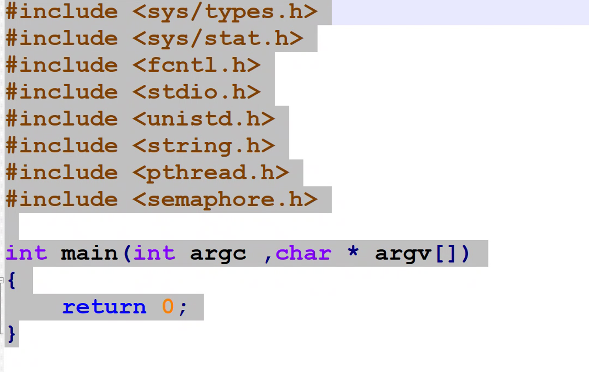


```c

#include<sys/types.h>
#include<sys/stat.h>
#include<fcntl.h>
#include<stdio.h>
#include<unistd.h>
#include<string.h>
#include<pthread.h>
#include<semaphore.h>

int main (int argc  , char *  argv[] )
{
	return  0;
}


```


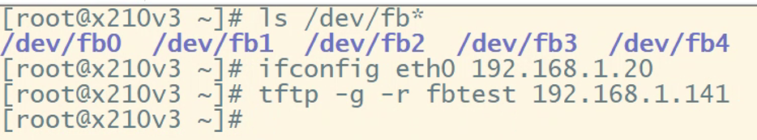

配IP 远端下载


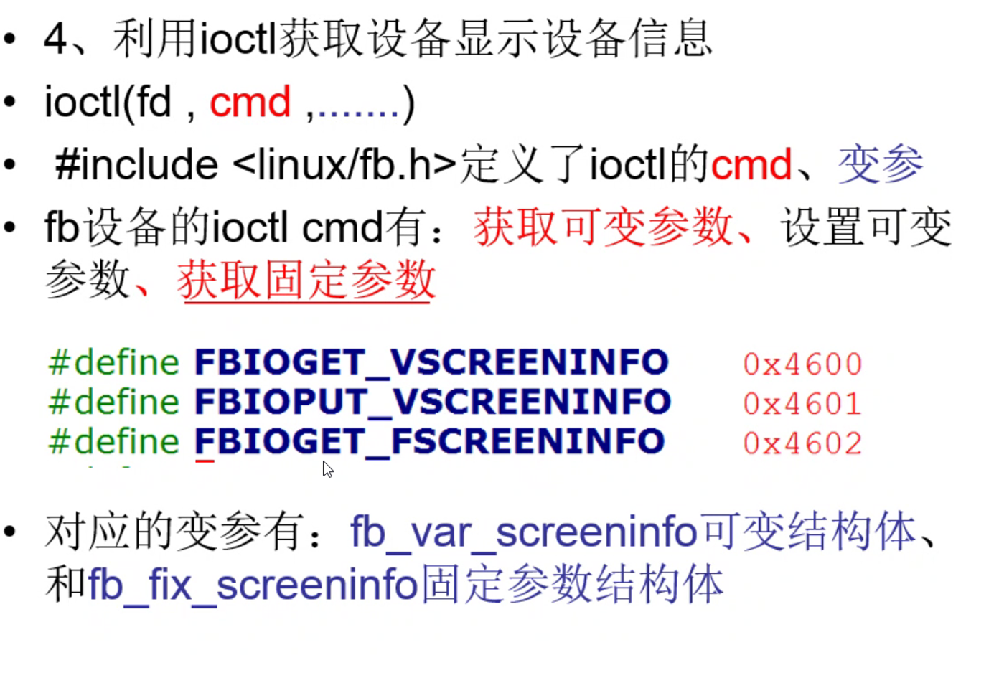

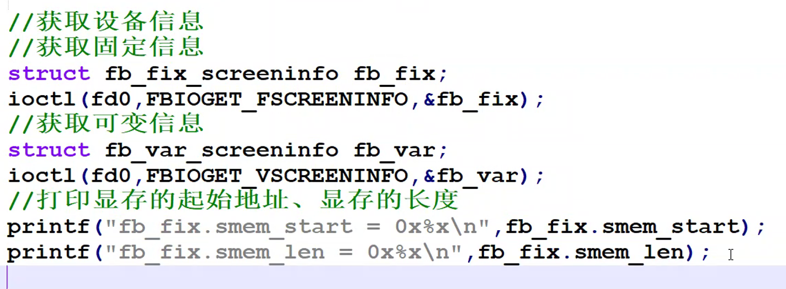


## 实验1

1、如何显示当前目录的位置？
pwd
2、目前你在你的姓名目录下 ，当执行以下命令后，会变到什么目录？
     cd  /home    到/home目录
     cd  ~     		到/home目录
     cd  .. 		到上一级目录
     cd /			到根目录
3、你在/目录下，如何将其中一个文件拷至你的学号名目录下，并且将其改名为99999.s，写出其命令。
	cp ./a /201/99999.s


## open与fopen的对比与使用
[Linux（C/C++）下的文件操作open、fopen与freopen](https://www.cnblogs.com/fnlingnzb-learner/p/7040726.html)


# 课外


## 制作静态库

程序较大，运行方便

```bash
gcc -c xx.c -o xx.o
ar -rcsv libxx.a xx.o
```

使用

```bash
gcc test.c -o test.o -static -I/include_path -L/path -lxx
```


## 制作动态库

程序较小，需要找到库

```bash
gcc -c -fpic xx.c -o xx.o
gcc -shared -fpic xx.o -o libxx.so
```

**找不到共享库时需要设置动态库的加载路径**


> `**gcc -o hello hello.c -I /home/hello/include -L /home/hello/lib -lworld**`
>
> 上面这句表示在编译hello.c时：
>
> **-I /home/hello/include表示将/home/hello/include目录作为第一个寻找头文件的目录，寻找的顺序是：/home/hello/include-->/usr/include-->/usr/local/include** 
>
> **-L /home/hello/lib表示将/home/hello/lib目录作为第一个寻找库文件的目录，寻找的顺序是：/home/hello/lib-->/lib-->/usr/lib-->/usr/local/lib**
>
>  **-lworld表示在上面的lib的路径中寻找libworld.so动态库文件（如果gcc编译选项中加入了“-static”表示寻找libworld.a静态库文件），\**程序链接的库名是\**\**world\****


## 添加环境变量

```bash
export XX=dldldl
```


## uboot


```bash
print		#查看环境变量
setenv abc 100 200		#设置/添加变量
setenv abc				#删除变量
saveenv					#保存本次设置

#网络层设置
setenv ipaddr 192.168.1.111
#使用开发板ping主机(开发板的echo被精简)

#传输层（port）
setenv serverip 192.168.1.3		#设置服务端ip	port默认69

#使用tftp
tftp 20008000 abc
md 20008000		#显示内存

#nand [动作] [内存地址] [nandflash的内部地址] [搬移大小]
#动作：erase\write\read
nand erase 500000 1024	#擦地址500000的1k
nand write 20008000 500000 1024	#从内存写入nandflash

go 20008000		#指针指向内存地址运行
bootm 20008000	#uboot格式内核启动 

# 内核启动条件
# bootargs
# 启动参数
# root= #启动的根文件系统在那个设备
# 	设备信息 ram NFS flash
# init= #内核启动后第一个运行文件init位置
# console= #内核启动时，使用哪个设备为控制台
setenv bootargs root=/dev/mtdblock2 init=/linuxrc console=ttySAC0,115200

# ramdisk(文件系统)		修改bootargs参数
# root=/dev/ram
#内存基地址0x2000 0000
# initrd=0x21000000,8M		#从2100 0000 取8M挂文件系统
setenv bootargs root=/dev/ram initrd=0x21000000,8M init=/linuxrc console=ttySAC0,115200

# NFS(文件系统 网络)
# tcp/ip
sudo apt install nfs-kernel-server	#安装服务端
sudo vi etc/exports					#修改配置
sudo /etc/init.d/nfs-kernel-server	#重启服务

tar -zxvf lintrd.img.gz				#解压文件系统
mount -t ext2 initrd.img ./swap/	#挂载
cp -a ./swap/* ./nfs_root			#拷贝到nfs根目录
#修改配置
setenv bootargs root=/dev/nfs nfsroot=192.168.10.110:/xxx/根的位置 ip=192.168.10.122 initrd=0x21000000,8M init=/linuxrc console=ttySAC0,115200

```


### uboot自动运行

```bash
setenv bootdelay  		#删掉启动延时
setenv bootcmd xxx		#设置启动命令


```


### uboot版本选择

[ftp://ftp.denx.de/pub/u-boot/](ftp://ftp.denx.de/pub/u-boot/)